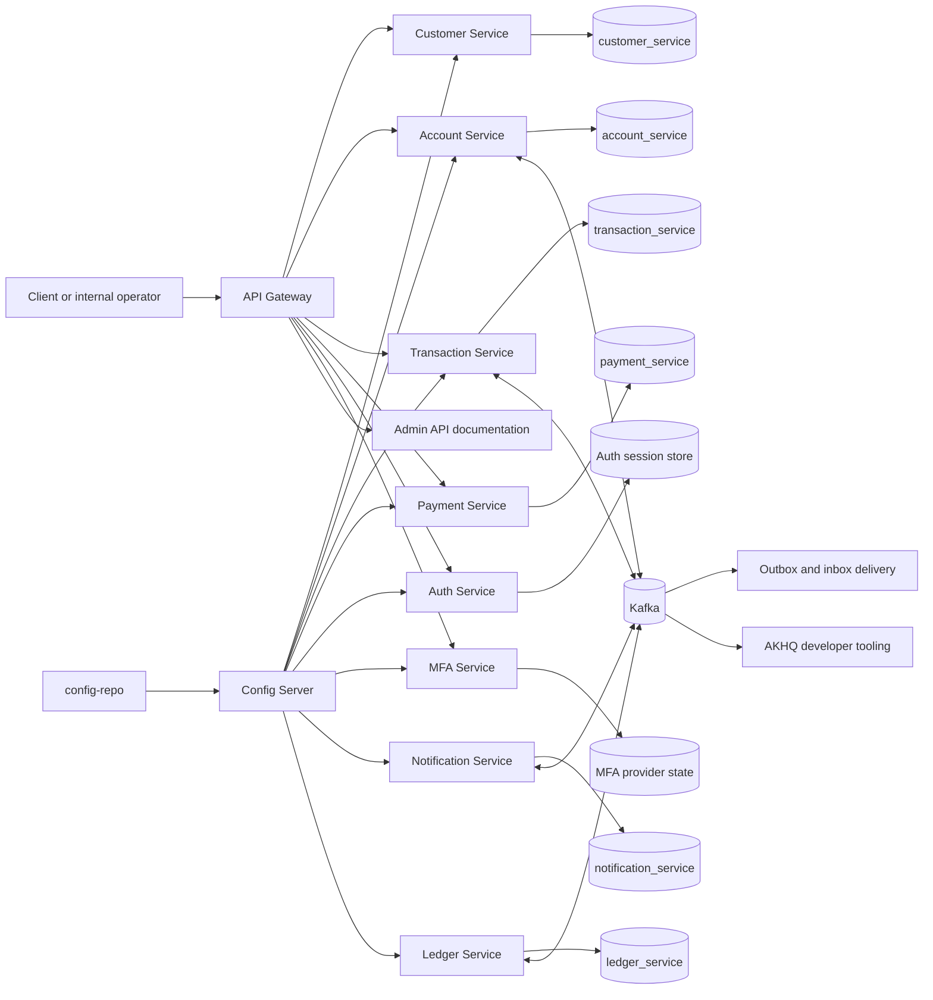
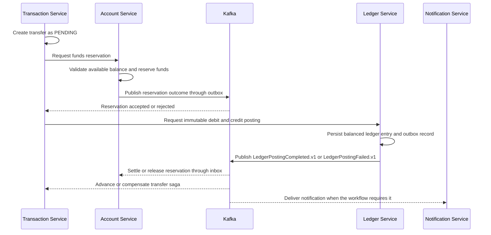
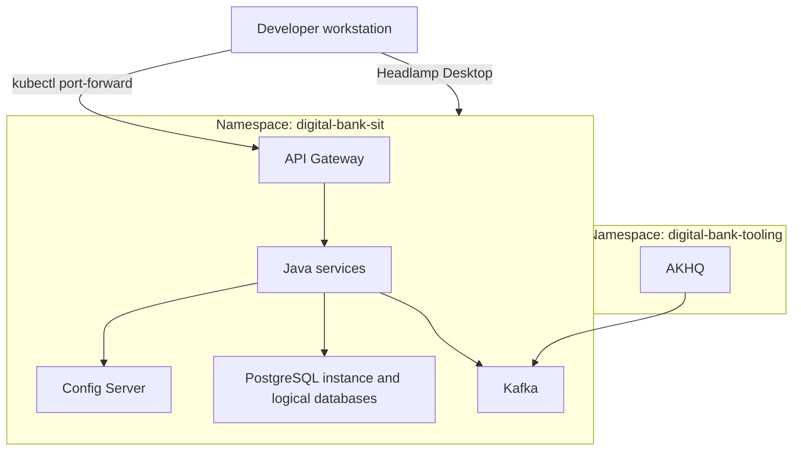

# Digital Bank Java Platform Architecture

This document is the high-level architecture view for the Digital Bank Java platform. It describes the current service boundaries, the local SIT deployment shape, and the intended financial-event flow. It is a system map, not a list of customer-facing APIs.

## System Context

Normal application traffic enters through the API Gateway. Services own their business capabilities and data; they do not query another service's database. Config Server supplies externalized runtime configuration from `config-repo`.



The diagram shows logical ownership. A shared PostgreSQL instance may host the logical databases in local SIT, but that does not create shared database ownership. In a hosted environment, the logical database mapping may move to managed PostgreSQL without changing the service boundaries.

## Service Responsibilities

| Service | Owns | Does not own |
| --- | --- | --- |
| API Gateway | Entry routing, resilience controls, and centralized internal API documentation | Business state or financial decisions |
| Customer Service | Customer identity and profile state | Accounts, balances, or transfers |
| Account Service | Account lifecycle, account lookup, reservations, and account projections | The immutable ledger or transfer status |
| Ledger Service | Balanced, immutable journal entries, reversals, and posting facts | Saga orchestration or account projection state |
| Transaction Service | Transfer workflow state and saga/process-manager decisions | The official financial journal |
| Payment Service | Payment instruction lifecycle and payment-specific state | Direct account balance mutation |
| Auth Service | Authentication sessions and signed access tokens | Customer profile or MFA enrollment state |
| MFA Service | MFA enrollment and challenge verification | Authentication session ownership |
| Notification Service | Notification delivery state and transfer notifications | Financial posting or transfer ownership |

## Transfer And Ledger Event Flow

The final account balance effect is driven by financial workflow events, not by a public balance-update endpoint.



Delivery is at least once. Outbox records are created with the business transaction, consumers use inbox identity and idempotency, and replay must be safe. Transaction Service owns the transfer saga; Ledger Service remains the financial posting authority and does not coordinate the saga.

The event contract and topic details are maintained in:

- [`docs/contracts/ledger-events-asyncapi.yml`](contracts/ledger-events-asyncapi.yml)
- [`docs/contracts/transfer-events-asyncapi.yml`](contracts/transfer-events-asyncapi.yml)
- [`docs/ledger-reconciliation.md`](ledger-reconciliation.md)

## Local SIT Topology

SIT is the lowest formal runtime environment and runs on Docker Desktop Kubernetes:



`digital-bank-tooling` contains developer tooling, not business services. Headlamp Desktop is the preferred local Kubernetes GUI; it is not part of the deployable banking runtime.

The standard local entry point is:

```bash
kubectl port-forward -n digital-bank-sit svc/api-gateway 8080:8080
```

Running one service from an IDE is workstation debugging against SIT with the `sit` profile and temporary port-forwarded dependency settings. It is not a separate `local` environment.

## Environment Promotion

| Environment | Runtime target | Purpose |
| --- | --- | --- |
| `sit` | Local Docker Desktop Kubernetes | Integrated development, contract checks, and repeatable demonstrations |
| `uat` | Future AWS Kubernetes and managed services | Acceptance testing and operational rehearsal |
| `prod` | Future AWS Kubernetes and managed services | Production banking workload |

The future AWS mapping is intentionally infrastructure-neutral at this layer. The current direction is EKS, managed PostgreSQL such as RDS or Aurora, managed Kafka such as MSK, AWS OpenSearch, and AWS-managed secrets. Cloud manifests and credentials remain Sprint 7 work.

## Boundary Rules

- Route normal service access through API Gateway.
- Keep administrative and aggregated documentation paths restricted and separate from customer APIs.
- Keep financial corrections append-only through compensating reversals.
- Keep secrets, tokens, OTP values, customer PII, and production endpoints out of Git.
- Add a tracked issue before changing a service boundary, port, topic contract, or deployment dependency.

