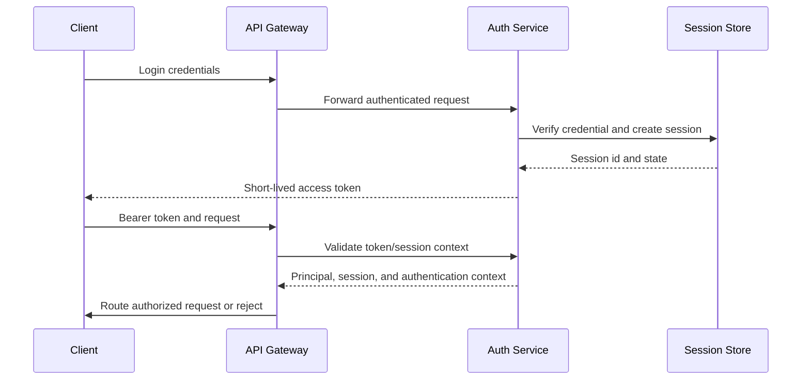
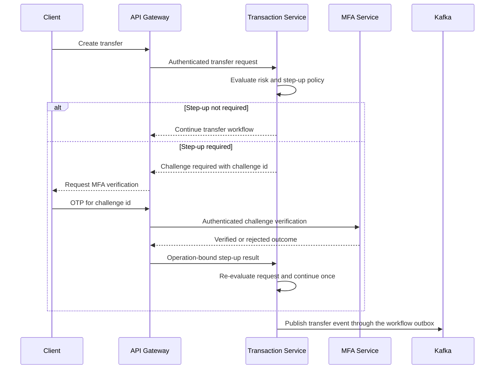

# Session, MFA, Step-Up, And Transfer Rail Design

This document defines the security boundary for authenticated banking actions and the transfer rails that will use it. It is the design contract for the Auth Service, MFA Service, API Gateway, Transaction Service, and the later payment and transfer workflows. It does not expose credentials, prescribe a cloud deployment, or replace service-owned implementation issues.

## Ownership

| Component | Responsibility | Must not own |
| --- | --- | --- |
| Auth Service | Authenticate credentials, issue and validate sessions/tokens, revoke sessions, and expose authentication context | Customer profile, MFA enrollment, transfer risk, or ledger state |
| MFA Service | Manage MFA enrollment and one-time challenge verification for an authenticated principal | Login sessions, transfer status, or financial posting |
| API Gateway | Apply edge authentication and route requests to internal services | The final authorization decision for business state |
| Transaction Service | Own transfer state, risk evaluation, step-up requirement, and saga progression | User credentials, MFA secrets, or immutable ledger facts |
| Account Service | Own reservations and account projections | Authentication or transfer risk policy |
| Ledger Service | Own immutable balanced postings and posting outcomes | Authentication, authorization, or saga orchestration |

Authentication proves who is acting. Authorization decides what that principal may do. Step-up authorization provides fresh, operation-specific evidence for a sensitive action. These are separate decisions and should not be collapsed into one boolean claim.

## Session Flow



The access token should contain only the claims needed by downstream authorization: subject, session id, issuer, audience, issued-at, expiry, and a token identifier where replay detection requires it. Credentials, passwords, OTP values, customer PII, and internal exception details never belong in a token.

The current Auth and MFA foundations use in-memory adapters in SIT. That is suitable for an isolated foundation demonstration, but a multi-replica deployment requires a durable or shared session/challenge store, key rotation, revocation strategy, and operational recovery before UAT or production.

## Step-Up Decision

Transaction Service owns the step-up decision because it owns the transfer's business context. It evaluates the operation using the authenticated principal and the complete transfer request, not only the requested amount.

Initial policy categories:

- high-value internal transfer;
- domestic transfer above the configured threshold;
- international transfer;
- a new or changed beneficiary or destination;
- a request that violates device, session-age, velocity, or risk controls.



The challenge and the step-up result must be bound to the authenticated principal and the intended operation. At minimum, the binding includes the session id, transfer id or idempotency key, operation type, amount, currency, source account, destination account or beneficiary, an expiry time, and a one-time nonce. A successful MFA verification for one transfer must not authorize another transfer.

The client must not be able to change any bound value after verification. If amount, currency, accounts, beneficiary, or operation type changes, the previous step-up result is invalid and a new challenge is required.

## Challenge Rules

MFA challenge state should have explicit transitions:

```text
ISSUED -> VERIFIED
ISSUED -> FAILED
ISSUED -> EXPIRED
ISSUED -> LOCKED
```

Required controls:

- short challenge lifetime and a server-side clock;
- bounded verification attempts and temporary lockout;
- one-time consumption of a successful challenge;
- constant-time comparison of verification material;
- replay rejection after `VERIFIED`, `EXPIRED`, or `LOCKED`;
- authorization that the caller is the challenge principal;
- rate limits on challenge creation and verification;
- sanitized responses that do not reveal whether a credential, enrollment, or account exists;
- no OTP, TOTP secret, provisioning URI, or raw credential in logs, events, traces, metrics, or problem details.

An MFA provider error is not the same as an invalid user code. The public response should remain stable while internal telemetry distinguishes retryable provider failure, invalid verification, expired challenge, and policy lockout.

## Transfer State And Idempotency

Transaction Service is the process manager for a transfer. Its state machine should distinguish business progress from delivery mechanics:

```text
PENDING
  -> RESERVATION_REQUESTED
  -> RESERVED
  -> POSTING_REQUESTED
  -> COMPLETED
  -> FAILED
  -> COMPENSATION_REQUIRED
```

The exact state names remain service-owned, but every transition must be guarded by the transfer id and an idempotency key. Replayed HTTP requests and redelivered Kafka events must not create a second reservation, posting, notification, or step-up authorization.

The expected financial sequence is:

1. Transaction Service records the transfer request and evaluates policy.
2. Account Service reserves funds when sufficient available balance exists.
3. Transaction Service requests Ledger Service to record the immutable movement.
4. Ledger Service publishes a completion or failure outcome through its outbox.
5. Account Service settles or releases the reservation idempotently.
6. Transaction Service advances or compensates the transfer saga.
7. Notification Service publishes customer-facing delivery only from the relevant workflow event.

Ledger Service must never be called to mutate a balance directly. A failed workflow uses reservation release or an append-only compensating reversal according to the point at which the financial fact was accepted.

## Authorization Boundaries

Authentication and authorization must be enforced at multiple boundaries:

- API Gateway rejects missing, malformed, expired, wrong-issuer, and wrong-audience tokens at the edge.
- Each service validates the token or trusted internal authentication context independently; services do not trust a client-supplied user id.
- Transaction Service authorizes the principal for the transfer and evaluates step-up policy.
- MFA Service authorizes access to the authenticated principal's enrollment and challenges.
- Account and Ledger Services enforce their own service and resource authorization when invoked internally.
- Internal Kafka consumers authorize topic access and validate event producer, type, version, and correlation metadata.

The gateway is an enforcement point, not the only enforcement point. Direct service access in SIT may be useful for debugging, but it must not make service-level authorization optional in the implementation.

## Failure And Recovery

| Failure | Expected handling |
| --- | --- |
| Invalid credentials | Return stable unauthorized problem response; do not reveal which credential failed |
| Expired session | Reject and require authentication again |
| Replayed or changed step-up request | Reject as an operation-binding conflict and require a new challenge |
| MFA provider timeout | Return a controlled retryable error; do not mark the challenge verified |
| Reservation rejected | Mark transfer failed without requesting a ledger posting |
| Ledger posting failure | Release the reservation through the governed event flow and mark the transfer failed |
| Consumer redelivery | Use inbox identity and idempotent state transition |
| Ambiguous financial state | Quarantine for authorized review; never rewrite an accepted ledger entry |

Every security-sensitive rejection should carry a correlation id for operators while keeping response detail safe. Security audit records and operational logs are separate concerns; audit records must preserve who, what, when, and the authorization decision without storing secrets.

## Delivery Boundaries

The following are the planned issue boundaries:

- Auth Service session foundation and token validation: `.github#45`.
- MFA provider, enrollment, and challenge lifecycle: `.github#49`.
- Transfer risk policy and step-up annotation: `.github#55`.
- MFA requirement for high-risk transfers: `.github#56`.
- MFA-required and MFA-not-required verification: `.github#57`.
- Insomnia step-up workflow evidence: `.github#58`.
- Transfer saga and event consistency: `.github#103` and the governed event contract.

The design does not require a dedicated orchestrator service. Transaction Service is the first saga/process manager; a separate orchestration service should be introduced only if multiple independent workflows justify a separate operational boundary.

## Security Acceptance Criteria

- A valid session is required for protected operations.
- Auth, MFA, transaction, account, and ledger ownership boundaries remain explicit.
- High-risk operations cannot bypass step-up policy by calling a downstream service directly.
- Step-up verification is short-lived, one-time, principal-bound, and operation-bound.
- Mutating requests and events are idempotent under replay.
- Failure handling never edits or deletes an accepted ledger entry.
- Secrets and sensitive values are absent from logs, events, examples, and problem responses.
- Durable session/challenge storage and key/revocation operations are completed before a multi-replica UAT or production deployment.

